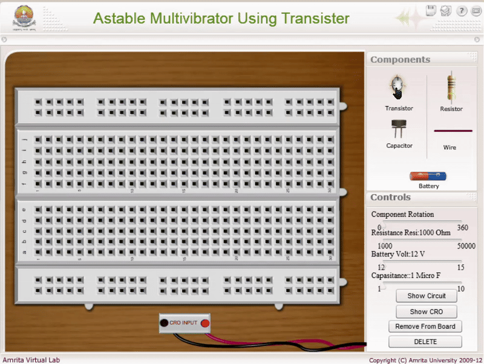
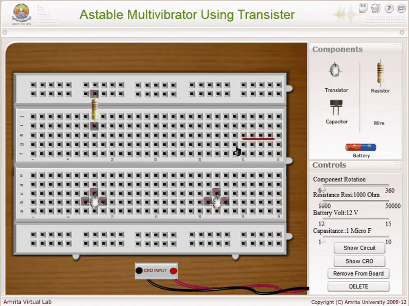

### Procedure

### Apparatus 

 Transistors, resistors, capacitors, inductance coil, dc power supply, C.R.O.

 
<h2>1. Designing</h2>

  <strong>Selection of Transistor:</strong> Use a high-frequency NPN transistor such as BF195.

  <strong>Component Values:</strong> 
  L = 10&nbsp;μH 
  VCE = 0.5 × VCC 
  VRE = VE = 0.1 × VCC 
  VRC = VC = 0.4 × VCC

<h3>Applying KVL for the Output Loop</h3>

  VCC = IC RC + VCE + IE RE 
  &nbsp;&nbsp;&nbsp;&nbsp;&nbsp;&nbsp;= IC RC + VCE + VE

  <strong>Therefore:</strong> 

$$R_C=\frac{V_{CC}-V_{CE}-V_{E}}{I_C}$$

$V_E=I_ER_E \approx I_CR_E$

There for 

$$R_E=\frac{V_E}{I_E}$$

<strong>Let</strong> VCC = 12V, β = 60 and IC = 1mA

<h3>Applying KVL for the Output Loop</h3>

  VCC = ICRC + VCE + IERE =
  ICRC + VCE + VE

<strong>Therefore</strong>:

$$R_E = \frac{V_{CC} - V_{CE} - V_E}{I_C} \approx 4.7k\,\Omega$$

$$V_E = I_E R_E \approx I_C R_E$$

$$R_E = \frac{V_E}{I_C} = 1.2\,k\,\Omega$$

$$I_{R1} \approx 21 I_B \quad \text{and} \quad I_{R2} = 20 I_B$$

$$\text{i.e.} \quad R_2 \leq \frac{1}{10} \beta R_E \approx 7.5\,k\Omega$$

$$V_{BB} = \frac{R_2}{R_1 + R_2} V_{CC} = V_{BE} + V_E = 0.7 + 1.2 = 1.9\,V$$

$$R_1 \approx 39\,k\Omega$$

<h3>Design of Feedback Network</h3>

<strong>Selection of capacitors:</strong> All capacitor values may be taken as 1μF.

<strong>Required frequency of oscillation:</strong> f = 1000 KHz

<strong>Let</strong> L = 10μH

  <strong>Frequency formula:</strong> 
$$f = \frac{1}{2\pi\sqrt{\frac{L C_{1} C_{2}}{C_{1} + C_{2}}}}$$

Effective capacitor Ceq = 2.5 nF

<strong>Therefore,</strong> C = 5 nF

<h2>Result</h2>

  Amplitude and frequency of sine wave from Colpitts Oscillator = ……….. V, ……….. Hz.

<h2>Procedure for simulator</h2>

<ol>
  <li>
    Begin by arranging the components on the virtual breadboard as shown in <strong>Animation 1</strong>. Refer to the visual guide carefully to place each component in its correct position.
  </li>

 

  <li>
    To connect the components, click on one end of the wire and then click on the corresponding point on the breadboard to complete the connection. Repeat this step to interconnect all necessary components.
  </li>

  

  
  <li>
    Follow the <strong>connection diagram</strong> to ensure the circuit is completed correctly. Double-check that all connections are made as shown in the schematic.
  </li>
  <li>
    Once the circuit is fully connected, click the <strong>"Show CRO"</strong> button in the simulator interface. This will display the waveform output on the virtual Cathode Ray Oscilloscope (CRO).
  </li>
</ol>

<h3>To Change the Component Value</h3>

<ol>
  <li>
    Select the component whose value you want to modify by clicking on it within the simulator.
  </li>
  <li>
    Use the slider on the right-hand side of the simulator to adjust the value (e.g., resistance, capacitance) as needed for the experiment.
  </li>
</ol>

