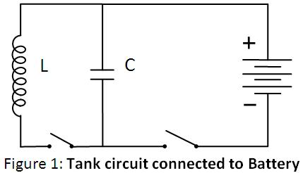
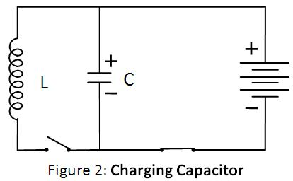
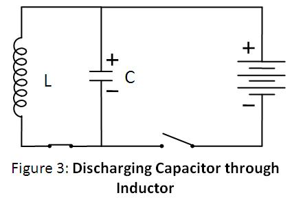
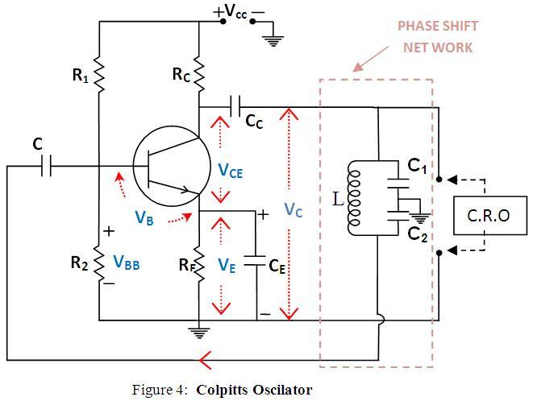

<h2>Theory</h2>

 

 

  A Colpitts oscillator, invented in 1920 by American engineer Edwin H. Colpitts, is a device that generates oscillatory output (sinusoidal).
  It consists of an amplifier linked to an oscillatory circuit, also called an LC circuit or tank circuit.
  One of the advantages of this circuit is its simplicity; it needs only a single inductor and is widely used in commercial signal generators up to 100 MHz.

<h3>Tank Circuit</h3>

  An LC circuit can store electrical energy oscillating at its resonant frequency.
  A capacitor stores energy in the electric field between its plates, depending on the voltage across it,
  and an inductor stores energy in its magnetic field, depending on the current through it.
  If a charged capacitor is connected across an inductor, charge will start to flow through the inductor,
  building up a magnetic field around it, and reducing the voltage on the capacitor.

 

 

  Eventually, all the charge on the capacitor will be gone and the voltage across it will reach zero.
  However, the current will continue, because inductors resist changes in current, and energy to keep it flowing is extracted from the magnetic field,
  which will begin to decline. The current will begin to charge the capacitor with a voltage of opposite polarity to its original charge.
  When the magnetic field is completely dissipated, the current will stop and the charge will again be stored in the capacitor,
  with the opposite polarity as before. Then the cycle will begin again, with the current flowing in the opposite direction through the inductor.

 

 

  The charge flows back and forth between the plates of the capacitor through the inductor.
  The energy oscillates back and forth between the capacitor and the inductor until
  (if not replenished by power from an external circuit) internal resistance makes the oscillations die out.
  Its action, known mathematically as a harmonic oscillator, is similar to a pendulum swinging back and forth,
  or water sloshing back and forth in a tank.
  For this reason, the circuit is also called a tank circuit.
  The oscillation frequency is determined by the capacitance and inductance values used.
  In typical tuned circuits in electronic equipment, the oscillations are very fast, thousands to millions of times per second.

<h2>About LC Oscillatory Network</h2>

  A Colpitts oscillator is the electrical dual of a Hartley oscillator.
  The basic Colpitts circuit consists of two capacitors and one inductor that determine the frequency of oscillation.
  The feedback needed for oscillation is taken from a voltage divider made of two capacitors,
  whereas in the Hartley oscillator, the feedback is taken from a voltage divider made of two inductors (or a single tapped inductor).

  LC oscillators are designed to operate in the radio-frequency range, typically above 1 MHz.
  However, they can also be designed to produce oscillations in the low audio-frequency range.
  For low-frequency operation, the inductors required become very large in value and thus physically large in size.
  Since the Colpitts oscillator is a high-frequency oscillator, the inductors used are in microhenries and the capacitors in picofarads (pF).

 

 

  The circuit oscillates when the components are suitably selected to satisfy the <strong>Barkhausen criteria</strong>:

  βA = +1 &nbsp;&nbsp; (Feedback factor must be unity)

  Where <strong>A</strong> is the gain of the amplifying element and <strong>β</strong> is the transfer function of the feedback path,
  so βA is the loop gain around the feedback loop of the circuit.

  There must also be positive feedback, i.e., the phase shift around the loop should be zero or an integer multiple of 2π.

  The frequency of oscillation is given by:

$$f=\frac{1}{2\pi \sqrt{LC_{eq}}}$$

  Where <em>Ceq</em> is the effective capacitance of the capacitors $C_1$ and $C_2$ , given by:

  Ceq = (C1 &times; C2) / (C1 + C2)

<h2>Working of Colpitts Oscillator</h2>

  The Colpitts Oscillator basically consists of a single-stage inverting amplifier and an L-C phase shift network, as shown in the circuit diagram (Fig. 4).
  The two series capacitors C1 and C2 form a potential divider used for providing the feedback voltage.
  The voltage developed across capacitor C2 provides the regenerative feedback required for sustained oscillations.

  The parallel combination of RE and CE, along with resistors R1 and R2, provides stabilized self-biasing.
  The collector supply voltage VCC is applied to the collector through a resistance RC, which permits the flow of maximum current through the transistor.

  The presence of the coupling capacitor Cc in the output circuit prevents DC currents from entering the tank circuit,
  which is essential because DC current flow reduces the Q factor of the tank circuit.
  The output of the phase-shift L-C network is coupled from the junction of L and C2 to the amplifier input at the base through the coupling capacitor Cc,
  which blocks DC but provides a path for AC signals.

  The transistor itself produces a phase shift of 180°, and another phase shift of 180° is provided by the capacitive feedback network.
  Thus, a total phase shift of 360° is obtained, which is a necessary condition for developing oscillations.

  The frequency of oscillation is determined by the tank circuit and can be varied by gang-tuning the two capacitors C1 and C2.
  It is important to note that capacitors C1 and C2 are ganged—meaning their values change together while maintaining the same ratio during tuning.

  The oscillations developed across capacitor C2 are applied to the base-emitter junction and appear in amplified form in the collector circuit.
  The frequency of this amplified output is the same as that of the oscillatory circuit.
  This amplified output is supplied back to the tank circuit to compensate for any losses, ensuring continuous energy supply.

  This energy is supplied in the correct phase to sustain oscillations.
  If the loop gain Aβ exceeds unity, the circuit maintains undamped oscillations.

